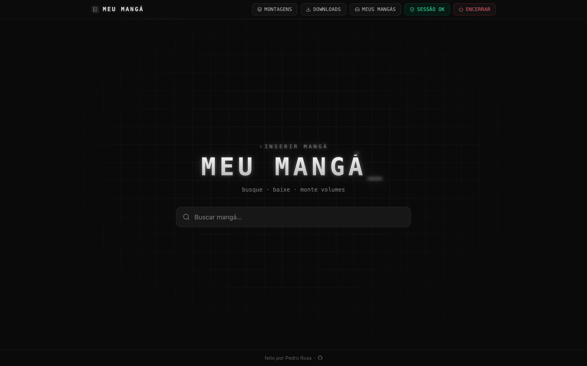
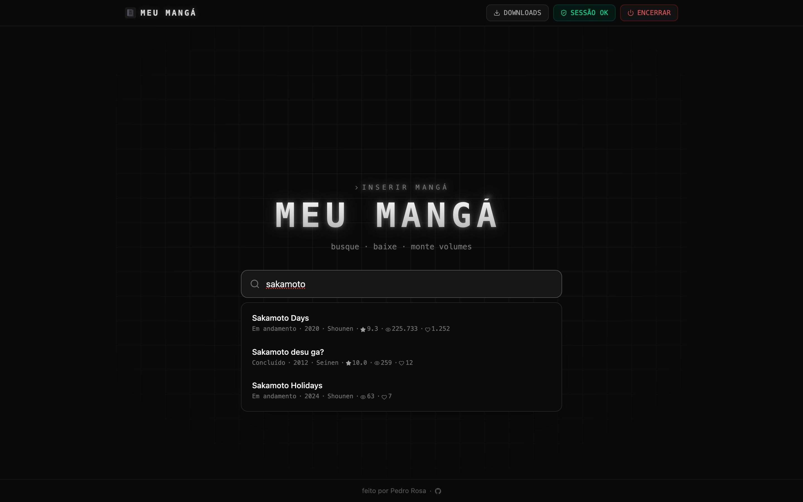
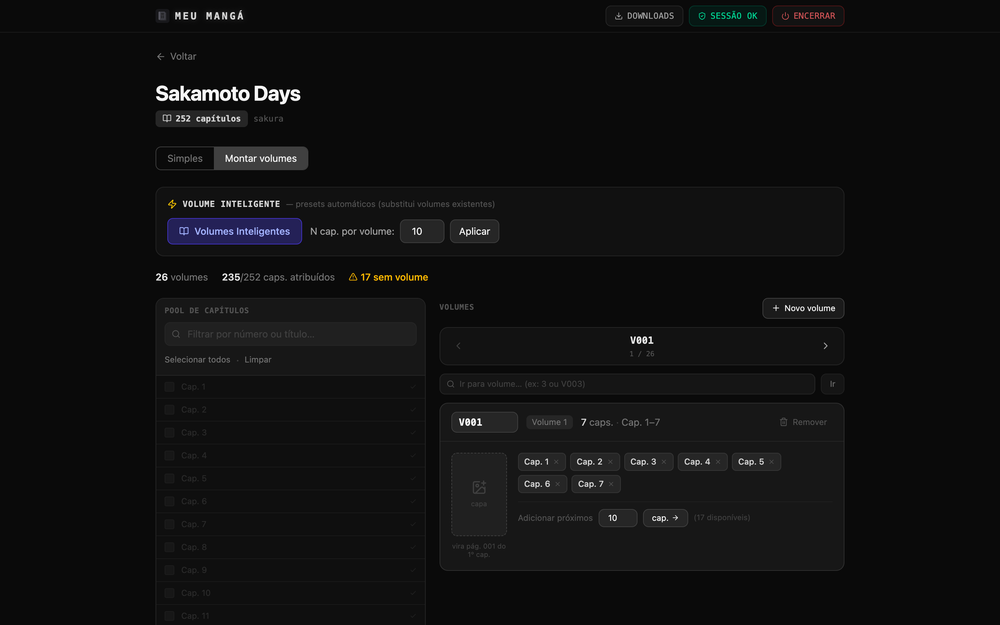
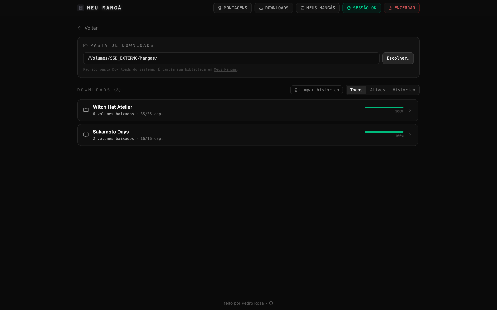
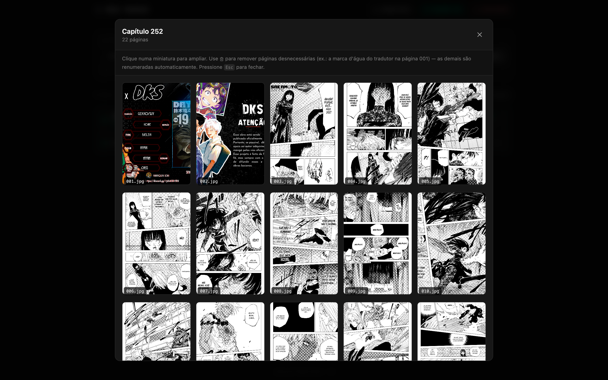

<p align="center">
  
</p>

<h1 align="center">Meu Mangá</h1>

<p align="center">
  Baixador local de mangás com interface web. Busque, monte volumes e baixe direto no seu computador.
</p>

<p align="center">
  
  
  
</p>

|  |  |
|:--:|:--:|
|  |  |
|  |  |

<p align="center">
  
</p>

<br>

<details open>
<summary><strong>Sobre</strong></summary>

<br>

**Meu Mangá** é um app web local (roda na sua máquina) para baixar mangás de forma
organizada. Você busca a obra, vê os capítulos, monta volumes (inclusive com capa) e
baixa tudo em JPGs numerados, prontos pro seu leitor ou pro Kindle.

Por enquanto o app usa apenas o conector do
<a href="https://sakuramangas.org/" target="_blank" rel="noreferrer">Sakura Mangás</a>,
então só encontra mangás em PT-BR. A arquitetura já é feita para múltiplos conectores.
A ideia é ser um "WeebCentral" para a comunidade, começando pelo PT-BR.

</details>

<details open>
<summary><strong>Requisitos</strong></summary>

<br>

- <a href="https://go.dev/dl/" target="_blank" rel="noreferrer">Go</a> 1.25 ou mais recente (backend)
- <a href="https://nodejs.org/" target="_blank" rel="noreferrer">Node</a> (serve o frontend)
- <a href="https://bun.sh/" target="_blank" rel="noreferrer">Bun</a> (build e dependências do frontend)
- Um navegador Chromium que você use (Chrome, Brave, Edge, Dia, Arc, Vivaldi, Opera)

**Sistemas:** roda em macOS, Linux e Windows. O app lê o cookie do seu navegador para
passar o Cloudflare (Keychain no macOS, Secret Service no Linux, DPAPI no Windows).
Testado principalmente no macOS; feedback de Linux e Windows é bem-vindo. No Windows,
versões recentes do Chrome com *app-bound encryption* podem não funcionar; nesse caso
use outro navegador Chromium, como Brave ou Edge.

</details>

<details open>
<summary><strong>Instalação</strong></summary>

<br>

```bash
git clone https://github.com/pedrorcruzz/meu-manga.git
cd meu-manga
make install
```

</details>

<details open>
<summary><strong>Como usar</strong></summary>

<br>

```bash
make
```

Isso compila e sobe tudo e abre o navegador em `http://localhost:3000`.

<details open>
<summary><strong>Sakura Mangás</strong></summary>

<br>

Mangás em PT-BR. O site é protegido por Cloudflare, então, uma vez, abra
<a href="https://sakuramangas.org/" target="_blank" rel="noreferrer">sakuramangas.org</a>
no seu navegador e passe o desafio "Um momento…". O app reaproveita esse cookie
automaticamente para acessar o site. Se o badge de sessão ficar vermelho, é só refazer
isso (tem um botão no aviso).

Ao baixar muitos capítulos, o site pode pedir um captcha do leitor. O app avisa qual
capítulo precisa; é só abrir ele no navegador e resolver.

</details>

**Estrutura dos arquivos baixados:**

```
Downloads/
└── Nome do Mangá/
    └── Nome do Mangá V001/
        └── Cap 1/
            ├── 001.jpg
            ├── 002.jpg
            └── ...
```

</details>

<details open>
<summary><strong>Comandos</strong></summary>

<br>

| Comando          | O que faz                                                        |
|------------------|------------------------------------------------------------------|
| `make`           | Compila e sobe backend e frontend (produção) e abre o navegador  |
| `make start`     | Igual ao `make`                                                  |
| `make localhost` | Sobe em modo dev (Vite HMR, hot-reload)                          |
| `make stop`      | Encerra tudo, libera as portas e apaga os builds                 |
| `make install`   | Baixa as dependências do backend e do frontend                   |

**Encerrar o programa:** dá pra encerrar de duas formas, rodando `make stop` no terminal
ou clicando no botão **Encerrar** no canto superior direito do app. Os dois desligam o
backend e o frontend e liberam as portas 8080 e 3000.

</details>

<details open>
<summary><strong>Conectores</strong></summary>

<br>

O Meu Mangá busca os mangás através de conectores. Cada site é um conector.

- **Sakura Mangás:** mangás em português (PT-BR). É o conector disponível hoje.

</details>

<br>

<p align="center">
  <strong>Se o Meu Mangá te ajudou, deixa uma estrela no repositório!</strong> Ajuda muito o projeto a crescer.
</p>
