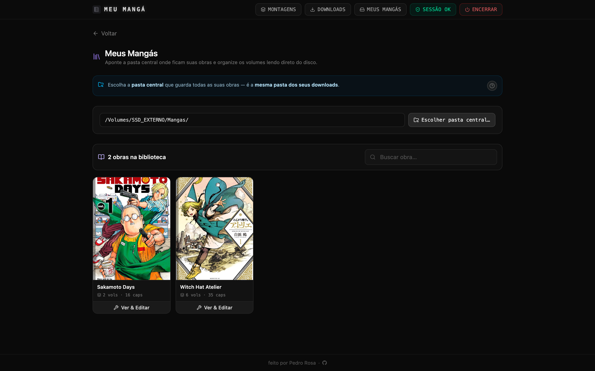
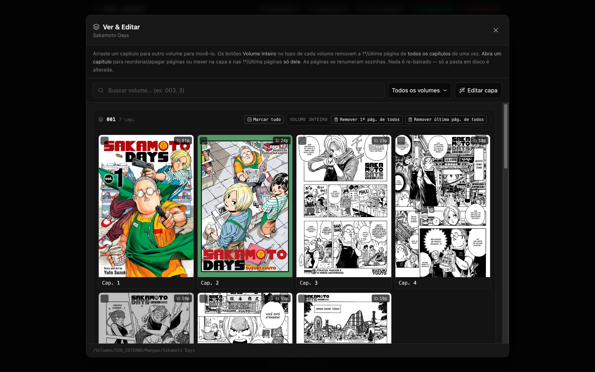
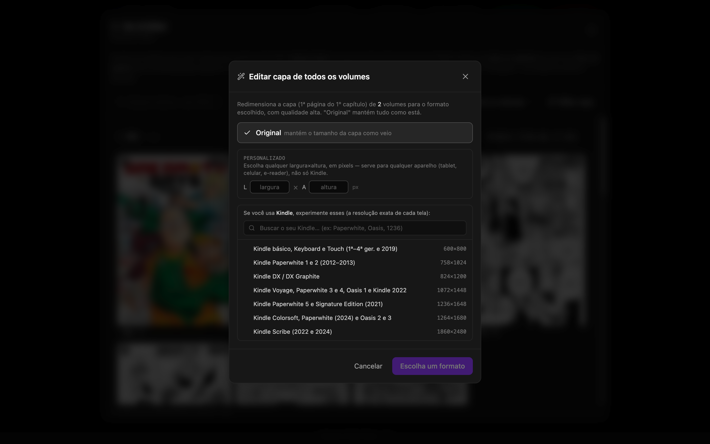

<p align="center">
  
</p>

<h1 align="center">Meu Mangá</h1>

<p align="center">
  Baixador local de mangás com interface web. Busque, monte volumes e baixe direto no seu computador.
</p>

<p align="center">
  
</p>

<p align="center">
  
  
  
</p>

|  |  |
|:--:|:--:|
|  |  |
|  |  |

<p align="center">
  
</p>

<br>

### Sobre

**Meu Mangá** é um app web local (roda na sua máquina) para baixar mangás de forma
organizada. Você busca a obra, vê os capítulos, monta volumes (inclusive com capa) e
baixa tudo em JPGs numerados, prontos pro seu leitor ou pro Kindle.

### Recursos

- **Buscar e baixar** por conectores (um site = um conector), em JPGs numerados
  prontos pro leitor.
- **Montar volumes** do jeito que quiser: agrupar capítulos, definir capa e o formato
  do nome dos volumes.
- **Ver & Editar volumes** direto na pasta em disco, sem re-baixar: mover capítulos
  entre volumes, corrigir números, reordenar/apagar páginas e mexer nas capas — as
  páginas se renumeram sozinhas.
- **Capa por formato**: ao adicionar/trocar a capa, dá pra redimensionar para a
  resolução exata do seu **Kindle** (busca por modelo — todos os aparelhos) ou um
  **tamanho personalizado**. O resize é de **alta qualidade** e serve pra qualquer
  aparelho, não só Kindle.
- **Editar capa em massa**: aplica um formato à capa (1ª página do 1º capítulo) de
  **todos os volumes** de uma vez.
- **Histórico do formato + voltar ao original**: o app guarda a capa original e o
  formato aplicado, então você vê que a capa foi alterada, qual formato foi usado, e
  pode **reverter** quando quiser.
- **Biblioteca "Meus Mangás"** e **histórico de downloads** com re-download por
  capítulo.

### Requisitos

- <a href="https://go.dev/dl/" target="_blank" rel="noreferrer">Go</a> 1.25 ou mais recente (backend)
- <a href="https://nodejs.org/" target="_blank" rel="noreferrer">Node</a> (serve o frontend)
- <a href="https://bun.sh/" target="_blank" rel="noreferrer">Bun</a> (build e dependências do frontend)
- Um navegador Chromium que você use (Chrome, Brave, Edge, Dia, Arc, Vivaldi, Opera)

### 1. Instalação e uso

No terminal, clone o projeto, entre na pasta e rode:

```bash
git clone https://github.com/pedrorcruzz/meu-manga.git
cd meu-manga
make
```

Só isso. O `make` baixa as dependências automaticamente (se ainda não tiver),
compila, sobe tudo e abre o navegador em `http://localhost:3000`. Não precisa
rodar `make install` antes.

**Estrutura dos arquivos baixados:**

```
Downloads/
└── Nome do Mangá/
    └── Nome do Mangá V001/
        └── Cap 1/
            ├── 001.jpg
            ├── 002.jpg
            └── ...
```

### 2. Comandos

| Comando          | O que faz                                                        |
|------------------|------------------------------------------------------------------|
| `make`           | Instala deps (se preciso), compila e sobe tudo e abre o navegador |
| `make start`     | Igual ao `make`                                                  |
| `make localhost` | Sobe em modo dev (Vite HMR, hot-reload) — também instala deps    |
| `make stop`      | Encerra tudo, libera as portas e apaga os builds                 |
| `make install`   | Baixa as dependências do backend e do frontend (opcional)        |

**Encerrar o programa:** dá pra encerrar de duas formas, rodando `make stop` no terminal
ou clicando no botão **Encerrar** no canto superior direito do app. Os dois desligam o
backend e o frontend e liberam as portas 8080 e 3000.

### 3. Conectores

O Meu Mangá busca os mangás através de conectores. Cada site é um conector.

<details open>
<summary>🌸 <strong>Sakura Mangás</strong></summary>

<br>

Mangás em PT-BR. O site é protegido por Cloudflare, então, uma vez, abra
<a href="https://sakuramangas.org/" target="_blank" rel="noreferrer">sakuramangas.org</a>
no seu navegador e passe o desafio "Um momento…". O app reaproveita esse cookie
automaticamente para acessar o site. Se o badge de sessão ficar vermelho, é só refazer
isso (tem um botão no aviso).

Ao baixar muitos capítulos, o site pode pedir um captcha do leitor. O app avisa qual
capítulo precisa; é só abrir ele no navegador e resolver.

</details>

<br>

<p align="center">
  ⭐ <strong>Se o Meu Mangá te ajudou, deixa uma estrela no repositório!</strong> Ajuda muito o projeto a crescer. ⭐
</p>
